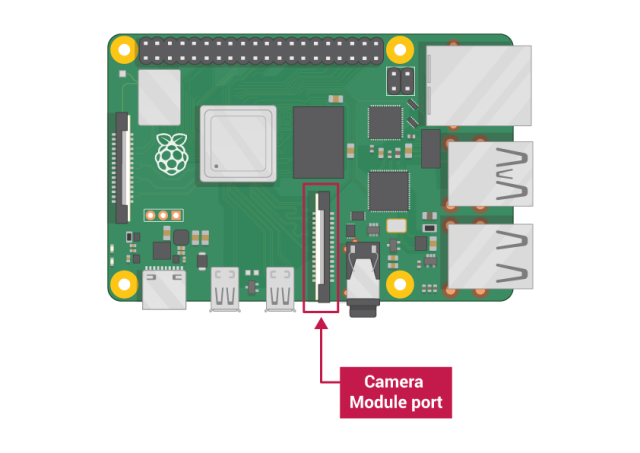
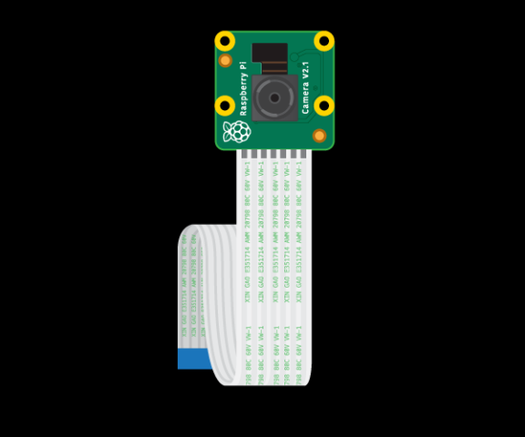
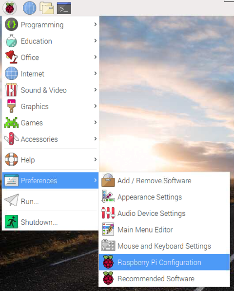
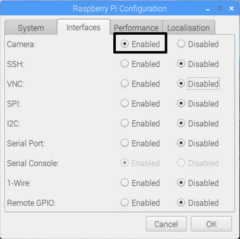
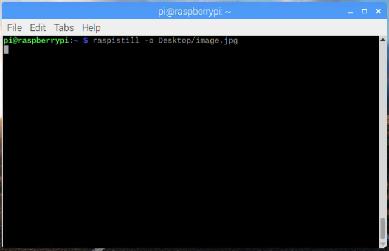
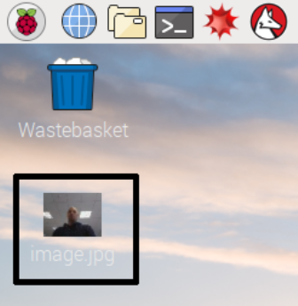
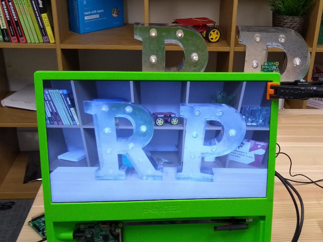
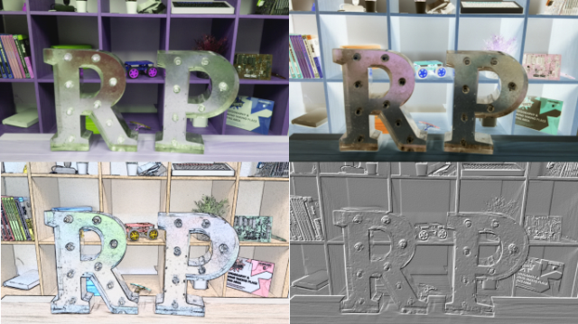

[Оригінал](https://projects.raspberrypi.org/en/projects/getting-started-with-picamera) 

## Introduction

Learn how to connect the Raspberry Pi Camera Module to your Raspberry Pi and take pictures, record video, and apply image effects.


## What you will need

### Raspberry Pi computer with a Camera Module port

All current models of Raspberry Pi have a port for connecting the Camera Module.



**Note:** If you want to use a Raspberry Pi Zero, you need a Camera Module ribbon cable that fits the Raspberry Pi Zero’s smaller Camera Module port.

### Raspberry Pi Camera Module



There are two versions of the Camera Module:

- [The standard version](https://www.raspberrypi.org/products/camera-module-v2/), which is designed to take pictures in normal light
- [The NoIR version](https://www.raspberrypi.org/products/pi-noir-camera-v2/), which doesn’t have an infrared filter, so you can use it together with an infrared light source to take pictures in the dark

## Connect the Camera Module

**Ensure your Raspberry Pi is turned off.**

1. Locate the Camera Module port
2. Gently pull up on the edges of the port’s plastic clip
3. Insert the Camera Module ribbon cable; make sure the cable is the right way round
4. Push the plastic clip back into place


- Start up your Raspberry Pi.

- Go to the main menu and open the **Raspberry Pi Configuration** tool.

  

- Select the **Interfaces** tab and ensure that the camera is **enabled**:

  

- Reboot your Raspberry Pi.

## How to control the Camera Module via the command line

Now your Camera Module is connected and the software is enabled, try out the command line tools `raspistill` and `raspivid`.

- Open a terminal window by clicking the black monitor icon in the taskbar:


- Type in the following command to take a still picture and save it to the Desktop:

```bash
raspistill -o Desktop/image.jpg
```



- Press Enter to run the command.

When the command runs, you can see the camera preview open for five seconds before a still picture is taken.

- Look for the picture file icon on the Desktop, and double-click the file icon to open the picture.

  

By adding different options, you can set the size and look of the image the `raspistill` command takes.

- For example, add `-h` and `-w` to change the height and width of the image:

```bash
raspistill -o Desktop/image-small.jpg -w 640 -h 480
```

- Now record a video with the Camera Module by using the following `raspivid` command:

```bash
raspivid -o Desktop/video.h264
```

- In order to play the video file, double-click the `video.h264` file icon on the Desktop to open it in VLC Media Player.

For more information and other options you can use with these commands, read the [documentation for raspistill](https://www.raspberrypi.org/documentation/usage/camera/raspicam/raspistill.md) and the [documentation for raspivid](https://www.raspberrypi.org/documentation/usage/camera/raspicam/raspivid.md).

## How to control the Camera Module with Python code

The Python `picamera` library allows you to control your Camera Module and create amazing projects.

- Open a Python 3 editor, such as **Thonny Python IDE**:

  

- Open a new file and save it as `camera.py`.

  **Note:** it’s important that you **never save the file as `picamera.py`**.

- Enter the following code:

  ```python
  from picamera import PiCamera
  from time import sleep
  
  camera = PiCamera()
  
  camera.start_preview()
  sleep(5)
  camera.stop_preview()
  ```

- Save and run your program. The camera preview should be shown for five seconds and then close again.

  

  **Note:** the camera preview only works when a monitor is connected to your Raspberry Pi. If you are using remote access (such as SSH or VNC), you won’t’ see the camera preview.

- If your preview is upside-down, you can rotate it by 180 degrees with the following code:

  ```python
  camera = PiCamera()
  camera.rotation = 180
  ```

  You can rotate the image by `90`, `180`, or `270` degrees. To reset the image, set `rotation` to `0` degrees.

It’s best to make the preview slightly see-through so you can see whether errors occur in your program while the preview is on.

- Make the camera preview see-through by setting an `alpha` level:

  ```python
  camera.start_preview(alpha=200)
  ```

  The `alpha` value can be any number between `0` and `255`.

## Take still pictures with Python code

Now use the Camera Module and Python to take some still pictures.

- Amend your code to add a `camera.capture()` line:

  ```python
  camera.start_preview()
  sleep(5)
  camera.capture('/home/pi/Desktop/image.jpg')
  camera.stop_preview()
  ```

  **Note:** it’s important to `sleep` for at least two seconds before capturing an image, because this gives the camera’s sensor time to sense the light levels.

- Run the code.

You should see the camera preview open for five seconds, and then a still picture should be captured. As the picture is being taken, you can see the preview briefly adjust to a different resolution.

Your new image should be saved to the Desktop.

- Now add a loop to take five pictures in a row:

  ```python
  camera.start_preview()
  for i in range(5):
      sleep(5)
      camera.capture('/home/pi/Desktop/image%s.jpg' % i)
  camera.stop_preview()
  ```

  The variable `i` counts how many times the loop has run, from `0` to `4`. Therefore, the images get saved as `image0.jpg`, `image1.jpg`, and so on.

- Run the code again and hold the Camera Module in position.

The camera should take one picture every five seconds. Once the fifth picture is taken, the preview closes.

- Look at your Desktop to find the five new pictures.

## Recording video with Python code

Now record a video!

- Amend your code to remove `capture()` and instead add `start_recording()` and `stop_recording()`

  Your code should look like this now:

  ```python
  camera.start_preview()
  camera.start_recording('/home/pi/Desktop/video.h264')
  sleep(5)
  camera.stop_recording()
  camera.stop_preview()
  ```

- Run the code.

Your Raspberry Pi should open a preview, record 5 seconds of video, and then close the preview.

## How to change the image settings and add image effects

The Python `picamera` software provides a number of effects and configurations to change how your images look.

**Note:** some settings only affect the preview and not the captured image, some affect only the captured image, and many others affect both.

### Set the image resolution

You can change the `resolution` of the image that the Camera Module takes.

By default, the image resolution is set to the resolution of your monitor. The maximum resolution is 2592×1944 for still photos, and 1920×1080 for video recording.

- Use the following code to set the `resolution` to maximum and take a picture.

  **Note:** you also need to set the frame rate to `15` to enable this maximum resolution.

  ```python
  camera.resolution = (2592, 1944)
  camera.framerate = 15
  camera.start_preview()
  sleep(5)
  camera.capture('/home/pi/Desktop/max.jpg')
  camera.stop_preview()
  ```

The minimum resolution is 64×64.

- Try taking a picture with the minimum resolution.

### Add text to your image

You can add text to your image using the command `annotate_text`.

- Run this code to try it:

  ```python
  camera.start_preview()
  camera.annotate_text = "Hello world!"
  sleep(5)
  camera.capture('/home/pi/Desktop/text.jpg')
  camera.stop_preview()
  ```

### Change the look of the added text

- Set the text size with the following code:

  ```python
  camera.annotate_text_size = 50
  ```

  You can set the text size to anything between `6` to `160`. The default size is `32`.

It’s also possible to change the text colour.

- First of all, add `Color` to your `import` line at the top of the program:

  ```python
  from picamera import PiCamera, Color
  ```

- Then below the `import` line, amend the rest of your code so it looks like this:

  ```python
  camera.start_preview()
  camera.annotate_background = Color('blue')
  camera.annotate_foreground = Color('yellow')
  camera.annotate_text = " Hello world "
  sleep(5)
  camera.stop_preview()
  ```

### Change the brightness of the preview

You can change how bright the preview appears. The default brightness is `50`, and you can set it to any value between `0` and `100`.

- Run the following code to try this out:

  ```python
  camera.start_preview()
  camera.brightness = 70
  sleep(5)
  camera.capture('/home/pi/Desktop/bright.jpg')
  camera.stop_preview()
  ```

- The following loop adjusts the brightness and also adds text to display the current brightness level:

  ```python
  camera.start_preview()
  for i in range(100):
      camera.annotate_text = "Brightness: %s" % i
      camera.brightness = i
      sleep(0.1)
  camera.stop_preview()
  ```

### Change the contrast of the preview

Similarly to the preview brightness, you can change the contrast of the preview.

- Run the following code to try this out:

  ```python
  camera.start_preview()
  for i in range(100):
      camera.annotate_text = "Contrast: %s" % i
      camera.contrast = i
      sleep(0.1)
  camera.stop_preview()
  ```

### Add cool image effects

You can use `camera.image_effect` to apply a particular image effect.

The image effect options are:

- `none`
- `negative`
- `solarize`
- `sketch`
- `denoise`
- `emboss`
- `oilpaint`
- `hatch`
- `gpen`
- `pastel`
- `watercolor`
- `film`
- `blur`
- `saturation`
- `colorswap`
- `washedout`
- `posterise`
- `colorpoint`
- `colorbalance`
- `cartoon`
- `deinterlace1`
- `deinterlace2`

The default effect is `none`.

- Pick an image effect and try it out:

  ```python
  camera.start_preview()
  camera.image_effect = 'colorswap'
  sleep(5)
  camera.capture('/home/pi/Desktop/colorswap.jpg')
  camera.stop_preview()
  ```

- Run this code to loop over **all** the image effects with `camera.IMAGE_EFFECTS`:

  ```python
  camera.start_preview()
  for effect in camera.IMAGE_EFFECTS:
      camera.image_effect = effect
      camera.annotate_text = "Effect: %s" % effect
      sleep(5)
  camera.stop_preview()
  ```

  

### Set the image exposure mode

You can use `camera.exposure_mode` to set the exposure to a particular mode.

The exposure mode options are:

- `off`
- `auto`
- `night`
- `nightpreview`
- `backlight`
- `spotlight`
- `sports`
- `snow`
- `beach`
- `verylong`
- `fixedfps`
- `antishake`
- `fireworks`

The default mode is `auto`.

- Pick an exposure mode and try it out:

  ```python
  camera.start_preview()
  camera.exposure_mode = 'beach'
  sleep(5)
  camera.capture('/home/pi/Desktop/beach.jpg')
  camera.stop_preview()
  ```

- You can loop over all the exposure modes with `camera.EXPOSURE_MODES`, like you did for the image effects.

### Change the image white balance

You can use `camera.awb_mode` to set the auto white balance to a preset mode.

The available auto white balance modes are:

- `off`
- `auto`
- `sunlight`
- `cloudy`
- `shade`
- `tungsten`
- `fluorescent`
- `incandescent`
- `flash`
- `horizon`

The default is `auto`.

- Pick an auto white balance mode and try it out:

  ```python
  camera.start_preview()
  camera.awb_mode = 'sunlight'
  sleep(5)
  camera.capture('/home/pi/Desktop/sunlight.jpg')
  camera.stop_preview()
  ```

- You can loop over all the auto white balance modes with `camera.AWB_MODES`, like you did for the image effects.