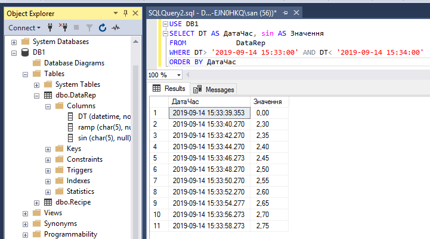

**Програмна інженерія в системах управління. Лекції.** Автор і лектор: Олександр Пупена 

| [<- до лекцій](README.md) | [на основну сторінку курсу](../README.md) |
| ------------------------- | ----------------------------------------- |
|                           |                                           |

# Мова SQL

***SQL*** (Structured Query Language – мова структурованих запитів) – це універсальна мова для створення, модифікації і керування даними в реляційних базах даних. Дана мова описана в ряді стандартів ANSI, ISO/IEC і на момент написання останньою версією є SQL:2019. На сьогоднішній день практично всі відомі СКБД підтримують даний стандарт, з деяким розширеннями до нього для адаптації під свої формати даних та функціональні можливості серверів. Такі мови називають діалектами SQL. Так, наприклад діалект СКБД MS SQL Server має назву «Transact-SQL», а MySQL – «SQL/PSM». Перед використанням SQL для конкретної СКБД варто ознайомитися з підтримуваними командами.

SQL використовується для створення структури бази даних, маніпуляції з даними, тобто їх вибірки і модифікації, та для їх адміністрування. Будь яка операція по вибірці, модифікації, визначенню або адмініструванню виконується за допомогою ***оператору*** (***statement***) або ***команди*** (***command***) SQL.

Є дві можливості операцій по маніпуляції з даними – ***вибірка даних*** (data retrieval) і ***модифікація даних*** (data modification). Вибірка – це пошук необхідних даних, а модифікація означає добавлення, знищення або заміна даних. Операції по вибірці називають ***SQL запитами*** (***SQL queries***). Вони проводять пошук в базі даних, найбільш ефективно вибирають необхідну інформацію і відображають її. У всіх запитах SQL використовується ключове слово `SELECT`. Операції по модифікації виконуються відповідно з використанням ключових слів `INSERT`, `DELETE` та `UPDATE`. 

На практиці частіше всього приходиться робити вибірку даних, для якого використовується оператор `SELECT`. Спрощена його конструкція має вигляд:

```sql
SELECT список_стовпчиків
FROM список_таблиць
[WHERE умови]
```

де слова в квадратних дужках `[]` – не обов’язкові.

У списку стовпчиків (полів записів) вказуються ті поля таблиці, які повертаються після обробки запиту. Список таблиць означує з яких таблиць необхідно проводити вибірку, а в умовах вказують умови для вибірки рядків. 

Розглянемо приклад, в якому необхідно зробити запит для вибірки даних з поля (колонки) `Value` таблиці `Group_1_1` бази даних `Difuzija_1`, які були записані після 19 вересня 2018 року. Дата запису знаходиться в полі `Group_1_1.TDate`. Запит матиме вигляд:

```sql
SELECT Value   
FROM  Difuzija_1.Group_1_1 
WHERE Group_1_1.TDate>'2018-09-19 00:00:00'
```

Якщо необхідно вибрати усі поля 

```sql
SELECT *   
FROM  Difuzija_1.Group_1_1 
WHERE Group_1_1.TDate>'2018-09-19 00:00:00'
```

Повний синтаксис оператора `SELECT` має наступний вигляд:

```sql
SELECT [ALL|DISTINCT] список_стовпчиків
[INTO нова_таблиця]
FROM {таблиця | курсор}[,{таблиця | курсор}…] 
[WHERE умови]
[GROUP BY стовпчик [, стовпчик…]]
[HEAVING умови]
[ORDER BY {ім’я_стовпчика | список_вибору}[ASC|DESC] ... ]
```

У списку `SELECT` вказуються ті поля (стовпчики), які необхідно повернути запитом. Є можливість зробити деякі операції над полями перед відображенням: +,-,*, /. 

Ключове слово `INTO` вказує на необхідність створення нової таблиці з вказаним іменем. 

Умови в `WHERE` задаються операторами порівняння (`=`,`<`,`>`, `>=`, `<=`, `!=` або `<>`), логічними (`AND`, `OR`, `NOT`), визначення діапазону (`BETWEEN` і `NOT BETWEEN`),  символьному порівнянню за шаблоном (`LIKE`) та ін.

Ключове слово `ORDER BY` дозволяє упорядковувати знайдені записи по вказаному стовпчику по зростанню `ASC`, або по спаданню `DESC`.

Для створення нового запису в таблиці БД, використовується оператор `INSERT`. Короткий синтаксис оператору:

```sql
INSERT INTO таблиця (стовпчик [, стовпчик…]) VALUES (значення1, [значення2, ...]) 
```

Для модифікації існуючих записів в таблиці використовується оператор `UPDATE`, який має наступний синтаксис: 

```sql
UPDATE [top(x)] <об'єкт>
SET <присвоєння1 [, присвоєння2, ...]>
[WHERE <умова>]
[OPTION <хінт1 [, хінт2, ...]>]
```

 де `top (x)` — команда виконається тільки `х` разів, `<об'єкт>` — об'єкт, над яким виконується дія (таблиця або подання (views)), <присвоювання> — присвоєння, яке буде виконуватися при кожному виконанні умови `<умова>`, або для кожного запису, якщо відсутній розділ `WHERE`, `<умова>` — умова виконання команди, `<хінт>` — інструкція програмі як виконати запит.

При необхідності використовувати мови SQL в ПЗ для доступу до даних, варто перевірити роботу SQL-запитів в тестових утилітах. Наприклад, `Microsoft SQL Server Management Studio` дає можливість не лише виконувати запити SQL, але і надає інструменти для їх побудови (`Query Designer`). На рис.1 показаний приклад перевірки SQL-запиту. 



Мова SQL задає тільки формат повідомлень запитів та відповідей між застосунком-клієнтом та сервером. Однак яким чином цей запит передається, як формується з’єднання між застосунками, створюється та розриваються сеанси і т.п. вирішується на інших рівнях взаємодії. Крім того, мова SQL розроблена для взаємодії з реляційними БД для інших типів вона не завжди застосовна. Нижче розглянуті стандартні програмні технології взаємодії з БД. 

[Довідник SQL](../Довідники/SQL.md)

| [<- до лекцій](README.md) | [на основну сторінку курсу](../README.md) |
| ------------------------- | ----------------------------------------- |
|                           |                                           |